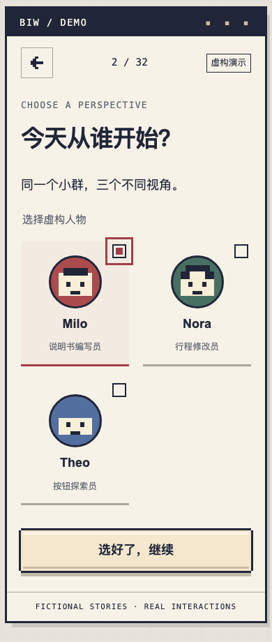
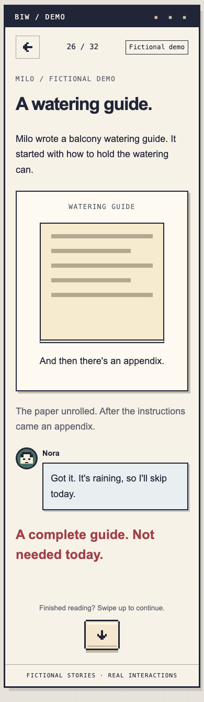
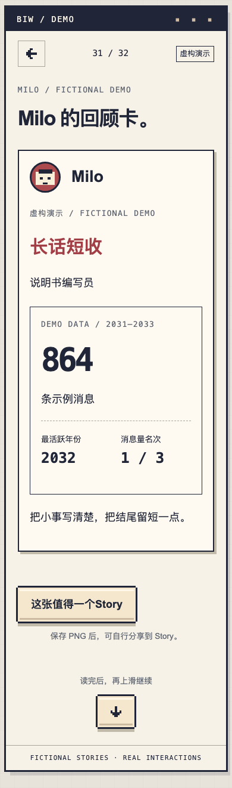

# Small Talk Wrapped

The fictional portfolio edition of BIW Wrapped.

**[Try the live demo](https://small-talk-wrapped.chrislee275.chatgpt.site)** — no sign-in required. All characters, stories and statistics are fictional.

**A mobile-first interactive story that turns a fictional group chat into three personal retrospectives.**

React · TypeScript · vinext

> Fictional portfolio demo: all story characters, dialogue, dates and statistics are invented. The illustrative assets are original; no private chat records or portraits of real people are included.

**My role:** I directed the product concept, visual direction, interaction requirements and review decisions, using AI assistance for implementation and test authoring. The focus is reader-controlled pacing: a shared story, one personal perspective and a few deliberate moments of interaction.

## A small story, built as a product

Choose Milo, Nora or Theo. Follow a common retrospective, explore a personal branch, unlock an achievement and download a PNG card. Each journey contains 32 screens: 24 shared screens and eight character-specific screens. The three branches use 48 content records in total.

| Choose a perspective                                            | Reveal a story                                                                            | Keep a fictional card                                                              |
| --------------------------------------------------------------- | ----------------------------------------------------------------------------------------- | ---------------------------------------------------------------------------------- |
|  |                         |                    |
| Choose one character; no perspective is preselected.            | Unfold an elaborate watering guide, then discover that today's rain makes it unnecessary. | Keep a character summary as a locally generated PNG, labelled as a fictional demo. |

The demo is English-only, including story dialogue, controls, accessibility labels and downloadable cards. The stories use short conversational exchanges rather than a literal translation of the earlier draft.

## Run locally

Requirements: Node.js 22.13+ and npm. No account, API key, database, sibling repository or private content source is required.

```sh
npm ci
npm run dev
```

Open **http://127.0.0.1:5186**. For production output:

```sh
npm run build
npm start
```

### Interaction guide

- **Open the story** starts the journey.
- Choose a character, then **Continue**. There is no default selection.
- Use the down arrow to advance. Scrolling reads the page first; a separate upward swipe at the bottom may advance. No screen auto-advances.
- **Show all** reveals content without waiting for motion.
- **Unroll the guide / Reveal the results / Restart** reveal the fictional outcome, not a choice of a different past.
- **Unlock achievement** reveals the character's award.
- **Story-worthy. Save it.** downloads a PNG; it does not post to a social network.
- At the end, **Try another perspective** selects another person and skips the common chapters; **Start again** restarts. Refresh returns to the safe opening.

## What this demonstrates

- **Product design:** narrative hierarchy, deliberate reveal pacing, and a motion budget with one personal signature per branch.
- **Frontend engineering:** typed content, one active person, memory-only state, explicit interaction configuration, clean timer/observer teardown and natural scrolling.
- **Accessible presentation:** DOM text, native radio controls, keyboard focus, reduced-motion support, show-all controls and visible image fallbacks.
- **Delivery judgment:** public-safe fixtures, an independent build, targeted tests and explicit limits on what has been verified.

## Design decisions

The visual language uses stepped pixel controls, cream story surfaces, neutral evidence panels and a navy finale. It uses no third-party game artwork, external fonts or runtime image services. Three original geometric SVG portraits stay small without a high-resolution photo pipeline.

Ordinary story screens show their heading and first passage immediately. Later reveals count time already spent reading, while punchlines retain a short hold. The name montage starts only when visible and pauses offscreen. The ending uses a separate, pausable credits sequence. Long content scrolls naturally; controls are not pinned over text.

Statistics, ranks and export cards read from the same fictional dataset. The export is rendered locally to a 1080 × 1920 canvas and visibly marked as fictional. Nothing is uploaded.

## Authorship and AI collaboration

I set the experience requirements and privacy boundaries, reviewed iterations, and requested changes to pacing, visual hierarchy and interactions. AI assistance produced implementation code, fictional story drafts, geometric asset code and automated tests. Design direction and acceptance decisions remain my responsibility; the implementation is not presented as entirely handwritten work.

The [case study](docs/2026-09-26-case-study.md) explains the tradeoffs. [English-edition checks](docs/2026-09-27-english-edition.md) cover the current copy and layout; the [initial QA record](docs/2026-09-26-qa.md) records the earlier build and clean-install checks. Real-device and assistive-technology checks remain unverified.

## Verify

```sh
npm run content:check
npm run lint
npm run typecheck
npm test
npx playwright install chromium
npm run test:e2e
npm run build
npm run audit:public
```

Browser tests cover the three journeys, boundary states and viewport scenarios. They also capture the three README screenshots from the fictional app. See [architecture](docs/2026-09-26-architecture.md), [case study](docs/2026-09-26-case-study.md), [asset provenance](docs/2026-09-26-assets.md) and [release checklist](docs/2026-09-26-release-checklist.md).

## Limits and licensing

This is a portfolio candidate, not a general-purpose CMS or analytics product. The vinext dependency is pinned to a beta release; no hosting workflow or automated deployment is provided. Synthetic data demonstrates interaction design, not real-world group analysis.

Source publication is authorised under `chrislee275/small-talk-wrapped`. The live demo is hosted separately on Sites; account-specific hosting configuration and credentials are not required to run this repository. No open-source license has been selected; this repository does not grant a general license to reuse its code or artwork. Third-party packages retain their respective licenses; see [notices](THIRD_PARTY_NOTICES.md).
